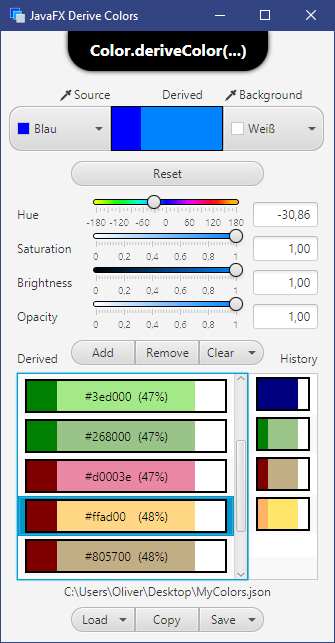
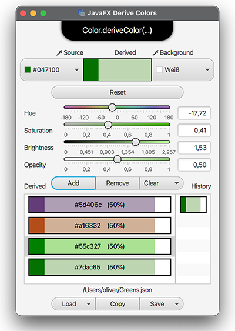

#  DeriveColorsFX

<a href="https://foojay.io/works-with-openjdk"></a>

This is not a serious application. Its a small tool where I just played with the method `Color::deriveColor` provided by JavaFX. Also its about playing with packaging and with modules.

## What is it?

* It lets you pick any color, either from the JavaFX color picker or with a pipette from your visible screen and any background color you like.
* Then it uses the `Color::deriveColor` function to create new colors based on a selected source color.
* To create a new color the parameters hue, brightness, saturation and opacity are adjustable.
* Slider controls are used for parameter adjustment and the slider control background is used as an interactive preview.
* Previews are created where the source color, the derivative color blended with the background and the background color are displayed.
* Eventually, sets of colors can be saved to `*.json` or `*.csv` files. For JSON serialization, the Jakarta JSON-Bindings API (`jakarta.json.bind-api`) in version 2.0 is used. Its just an experiment how this works. For CSV I was playing with Reflection in order to mimic how the JSON-B adapter worked until I found `com.opencsv:opencsv:5.5.2`. Well but there I was not yet successful in getting it working the modular-way. OpenCSV is actually very comfortable to use, its just not yet modularized. Hence some work still ahead.

## Things that dont work as expected:
* Well, the color pipette has currently an issue on MacOS (but most likely on any other system with HiDPI scaling). The app creates screenshots for each screen using the `javafx.scene.robot.Robot().getScreenCapture(...)` function. Then, the screenshot is displayed in a stage for each screen. Unfortunately, on MacOS with Retina display, the image turnsout to be blurry as it is only half of the required resolution - don't know yet whats wrong there. Most likely I am using the API in a wrong way and yup, need to read here.
* OpenCSV is not yet working due to lack of a module descriptor.

## Screenshots

<div>
  
  
</div>

### Running the app without packaging

As the Maven-JavaFX plugin is used, the app can be launched as:

```cmd
> git clone https://github.com/Oliver-Loeffler/DeriveColorsFX.git
> cd DeriveColorsFX
> mvn javafx:run
```

### Install on Windows
* ensure that any Java-17 JDK is available, e.g. from https://adoptium.net/
* ensure that your command line environment has access to all the JDK17 command line tools such as Jlink, JPackage, JDeps etc.

```cmd
> git clone https://github.com/Oliver-Loeffler/DeriveColorsFX.git
> cd DeriveColorsFX
> mvn package
> win-package.bat
```

* `win-package.bat` will create an MSI installer located in `target/win-installer`
* Alternatively, a pre-built MSI can be downloaded from [https://fx.raumzeitfalle.net/downloads/derivecolors/DeriveColorsFX-1.0.0.msi](https://fx.raumzeitfalle.net/downloads/derivecolors/DeriveColorsFX-1.0.0.msi)

### Install on MacOS

* Download and Install at least Java-17, e.g. from https://adoptium.net/
* Ensure that the new JDK is available on your command line.
* ensure a recent version of Maven is installed (3.8+)

```bash
# First list all installed JDKs - JDK17 should be listed there
% /usr/libexec/java_home -V

# In case multiple JDKs are installed, switch to 17.
% export JAVA_HOME=`/usr/libexec/java_home -v 17`

# clone the project from Github
% git clone https://github.com/Oliver-Loeffler/DeriveColorsFX.git
% cd DeriveColorsFX
% sh mac-package.sh
```

* `mac-package.sh` will execute the Maven build followed by `jlink` and `jpackage` so that eventually a PKG image will be available in `target/mac-installer`.

